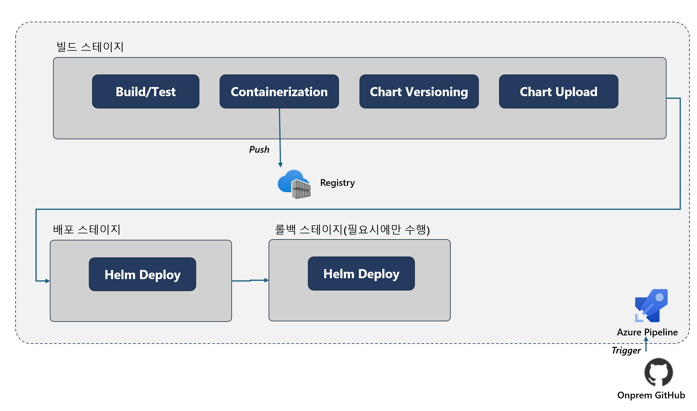
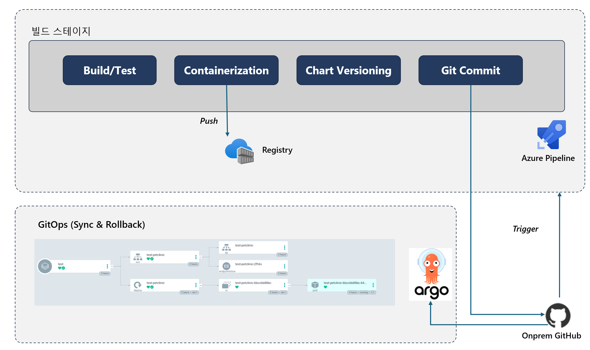
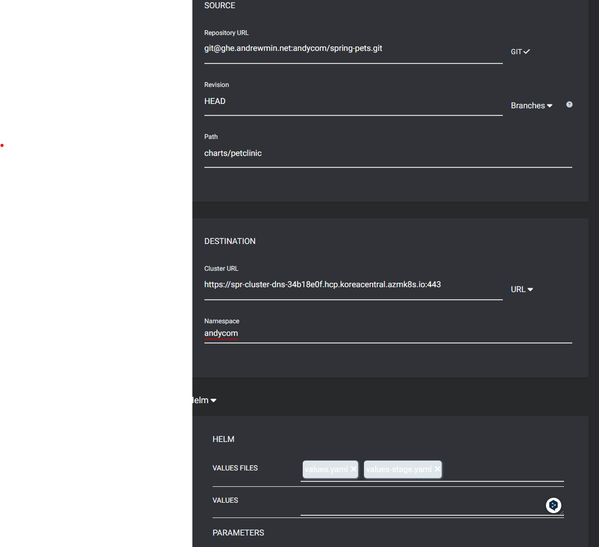
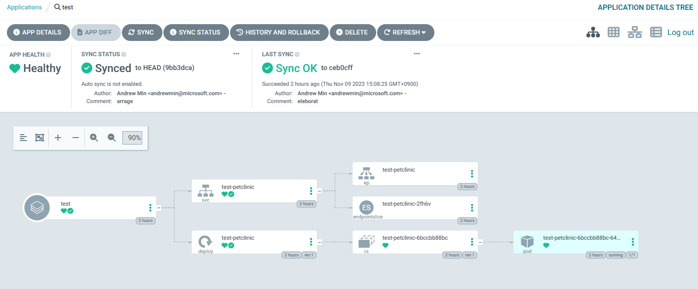

# Azure DevOps Handson

## Overview

### Azure Pipeline 기반 CI/CD



### Azure Pipeline + GitOps 기반 CI/CD



## 코드 준비

* https://github.com/HakjunMIN/spring-petclinic 클론 후 .git 삭제
* onprem github에 리파지토리 생성 후 remote설정

## Onprem GitHub 연계

1. Pipeline > New Pipeline > `native Azure DevOps experience`
2. `Github Enterprise Server` > 기존 연결 사용 > All repositories > 리파지토리 선택 > Save
3. `azure-pipelines.yml` 편집 > RUN하지 말고 SAVE

## TO-DO

1. Kubernetes 서비스 커넥션 설정
    * Cluster Role, Cluster Role Binding 생성
        [파일 참고](./sa-rolebinding.yml)
    * 네임스페이스 별 SA및 SA secret 생성
    * Environment에서 정의 후 자동생성되는 Connection사용
        * Environment 및 Resource생성
    * Generic Provider Kubernetes Service Account 
    * Server URL: https://spr-cluster-dns-34b18e0f.hcp.koreacentral.azmk8s.io:443
    * `Accept untrusted certificates` 선택
    * (선택) 추가 K8S 리소스를 Environment에 추가할 수 있음.

2. Spring Boot App 분석
    * App분석
    * Helm Chart분석

3. Self Hosted Agent 
    * Packer를 이용한 빌드머신 이미징

4. 기본환경 설정

    * 이미지 리파지토리는 각자의 namespace로 만들 것. 아래 imageRepository 변경 예: `ns1/spring-petclinic`

    ```yml
    resources:
    - repo: self

    pool:
      name: agents2

    variables:
      dockerRegistryServiceConnection: 'spreg'
      imageRepository: 'petclinic/spring-petclinic-monolith'
      containerRegistry: 'spreg.azurecr.io'
      dockerfilePath: '**/Dockerfile'
      tag: '$(Build.BuildId)'
      imagePullSecret: 'azurespringacr1580782c-auth'
    ```    

5. Build 스테이지 Yaml작성
    * Build and Test

        <details>
        <summary>코드보기</summary>

        ```yml
        - task: Gradle@3
          inputs:       
            gradleWrapperFile: 'gradlew'
            tasks: 'build'
            publishJUnitResults: true        
            testResultsFiles: '**/TEST-*.xml'
            javaHomeOption: 'JDKVersion'
            jdkVersionOption: 1.17
        ```
        </details>

    * Dockerize and Push

        <details>
        <summary>코드보기</summary>

        ```yml
        - task: Docker@2
          displayName: Build and push an image to container registry
          inputs:
            command: buildAndPush
            repository: $(imageRepository)
            dockerfile: $(dockerfilePath)
            containerRegistry: $(dockerRegistryServiceConnection)
            tags: |
              $(build.sourceBranchName)
        ```     
        </details>        

    * Helm Chart 버전 변경 및 후속 스테이지에 아티팩트 전달

        <details>
        <summary>코드보기</summary>

        ```yml
        - task: Bash@3    
          displayName: 'Update version to Helm Charts'
          inputs: 
            targetType: inline
            script: |
            sed -i 's/tag:.*/tag: $(build.sourceBranchName)/g' charts/*/values*.yaml
            sed -i 's/appVersion:.*/appVersion: $(build.sourceBranchName)/g' charts/*/Chart.yaml
    
        - task: PublishPipelineArtifact@1
          inputs:
            targetPath: 'charts'
            artifact: charts
        ```
        </details>

6. Pipeline Deploy 

    * Deploy 스테이지

        * 조건을 넣어서 특정 버저닝에만 배포되도록 설정 가능 예: `condition: contains(variables['build.sourceBranch'], 'SNAPSHOT')`

        * 아래 yaml파일에서 namespace를 변경해줘야 함. 

        <details>
        <summary>코드보기</summary>

        ```yml
          - stage: Deploy
            displayName: Deploy Snapshot to Dev environment
            dependsOn: Build
        
            jobs:
            - deployment: Deploy
                displayName: Deploy
                environment: 'dev.spring-pets'
                strategy:
                runOnce:
                    deploy:
                    steps:
                    - task: HelmDeploy@0
                        inputs:
                        connectionType: 'Kubernetes Service Connection'
                        kubernetesServiceConnection: 'dev-spring-pets-1698724967311'
                        namespace: 'spring-pets'
                        command: upgrade
                        chartType: Name
                        chartName: '$(Pipeline.Workspace)/charts/petclinic'
                        overrideFiles: '$(Pipeline.Workspace)/charts/petclinic/values-stage.yaml'
                        releaseName: 'petclinic-dev'
                        arguments: '--create-namespace'
        ```
        </details>

    * 승인 프로세스 넣기

        * environment내 Approval 기능 활용    

    * Rollback 스테이지

        * History를 통해 이력확인 후 Rollback수행

        <details>
        <summary>코드보기</summary>

        ```yml
          - stage: rollback
            displayName: Rollback
            dependsOn: Deploy
            jobs:
            - deployment: Rollback
                displayName: Rollback
                environment: 'dev.spring-pets'
                strategy:
                runOnce:
                    deploy:
                    steps:
                    - task: HelmDeploy@0
                        inputs:
                        connectionType: 'Kubernetes Service Connection'
                        kubernetesServiceConnection: 'dev-spring-pets-1698724967311'
                        namespace: 'spring-pets'
                        command: rollback
                        arguments: 'petclinic-dev 0'    
            
        ```
        </details>

7. ArgoCD를 이용한 GitOps기반 배포

    * Git에 Commit으로 배포환경을 관리하므로 chart변경분을 commit 

    <details>
    <summary>코드보기</summary>

    ```yml
        - script: |
            git config --global user.email $(gituserEmail)
            git config --global user.name $(gituserName)
            git pull origin main
            git add charts/*
            git commit -m "version $(build.sourceBranchName) to Charts"
            git push origin HEAD:main
        displayName: 'Commit for GitOps'
        workingDirectory: $(build.SourcesDirectory)
        
    ```
    </details>

    * Rollback은 GitOps툴에서 실행

8. ArgoCD 구성

    * GitHub > User Settings > SSH and GPG key > New SSH key에 개인의 Public 키 저장
    * ArgoCD > Settings > Repositories > Connect Repo

        * VIA SSH, git, Repository는 scp형태로 `git@ghe.andrewmin.net:andycom/spring-pets.git`, SSH Private key data입력

    * Applications > New App
    
        * General 항목 적절히 
        * Source선택, Path는 manifest나 chart있는 디렉토리 탐지됨.
        * Destination URL는 Cluster URL입력, 배포될 Namespace
        
            > [!IMPORTANT]
            > cluster내에 namespace 생성

        * Helm은 value의 순서대로 차례로 반영. 뒤에 파일이 앞에 파일로 Override
        * Value수동 업데이트 시 Values파라미터 사용
        
    

    * 생성된 App을 열어 `SYNC`를 통해 배포한 후 배포된 앱 모니터링

    

    * 배포 이후 `History and Rollback`기능을 이용하여 이력 조회 및 Rollback처리


